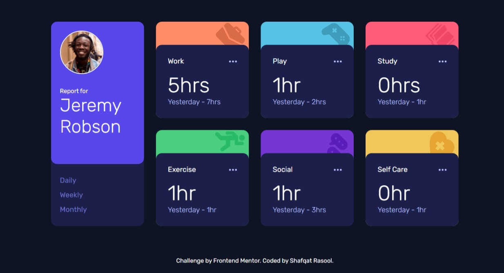

# Frontend Mentor - Time tracking dashboard solution

This is a solution to the [Time tracking dashboard challenge on Frontend Mentor](https://www.frontendmentor.io/challenges/time-tracking-dashboard-UIQ7167Jw). Frontend Mentor challenges help you improve your coding skills by building realistic projects. 

## Table of contents

- [Overview](#overview)
  - [The challenge](#the-challenge)
  - [Screenshot](#screenshot)
  - [Links](#links)
- [My process](#my-process)
  - [Built with](#built-with)
  - [What I learned](#what-i-learned)
  - [Continued development](#continued-development)
- [Author](#author)


## Overview

### The challenge

Users should be able to:

- View the optimal layout for the site depending on their device's screen size
- See hover states for all interactive elements on the page
- Switch between viewing Daily, Weekly, and Monthly stats

### Screenshot



### Links

- Solution URL: [Add solution URL here](https://your-solution-url.com)
- Live Site URL: [https://shafqatrasool11.github.io/time-tracking-dashboard-main/([https://your-live-site-url.com](https://shafqatrasool11.github.io/time-tracking-dashboard-main/))

## My process

### Built with

- Semantic HTML5 markup
- CSS custom properties
- Flexbox
- CSS Grid

### What I learned

While solving this challenge I learned how to hide/show multiple elements using a single javascript function, use variables in css for the first time.

```js
//Javascript function I used to show/hide multiple elements

function showArticles(classToShow) {
  const allArticles = document.querySelectorAll('.box__data');

  allArticles.forEach((article) => {
    if (article.classList.contains(classToShow)) {
      article.style.display = 'flex';
    } else {
      article.style.display = 'none';
    }
  });
}
```

### Continued development

I will be focused in refining my javascript and learning new concepts in it.


## Author

- Website - [Shafqat Rasool](https://Shafqatrasool.com)
- Frontend Mentor - [@shafqatrasool11](https://www.frontendmentor.io/profile/shafqatrasool11)
- linkedin - [Shafqat Rasool](https://www.linkedin.com/in/shafqat-rasool)
